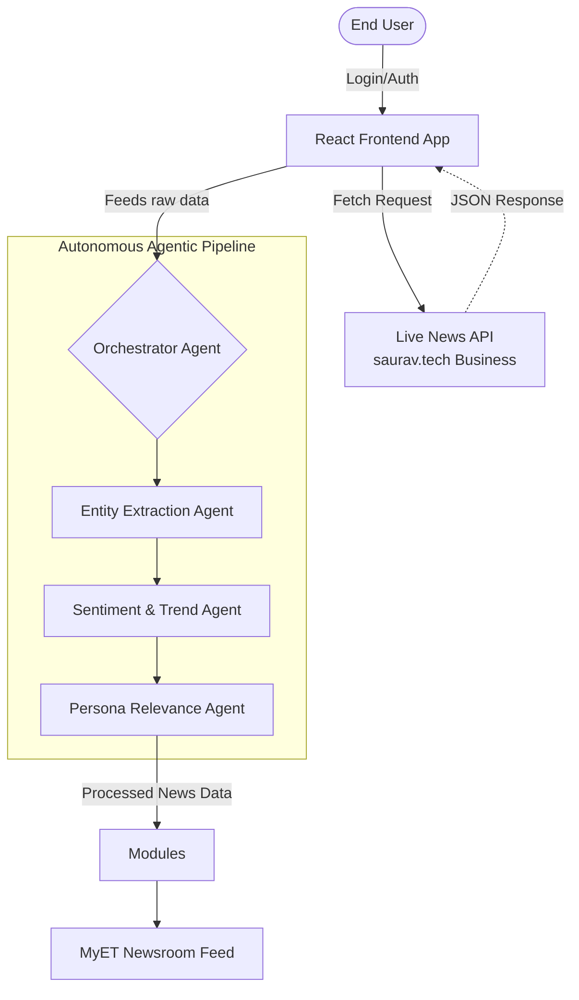

  

# MyET AI: The Autonomous Personal Newsroom
**A dynamic, autonomous multi-agent pipeline built for The Economic Times.**

## 📌 Overview
MyET AI completely reconstructs the modern news consumption experience. By leveraging an autonomous multi-agent pipeline, live business news is retrieved, analyzed by simulated LLMs, tagged for financial sentiment, and mapped to user-specific personas (e.g., "Mutual Fund Investor" vs "Startup Founder").

### 🚀 Key Features

*   **📰 Personalized Newsroom:** Dynamic article ranking based on real-time agentic analysis of live API responses.
*   **💬 NewsNavigator:** Conversational AI synthesis interface allowing users to investigate underlying news themes.
*   **🎬 AI News Video Studio:** Browser-native Text-To-Speech (TTS) automatically synthesizing written articles into short-form broadcast formats.
*   **📈 StoryArc Tracker:** Visual flow of developing, high-impact localized narratives.
*   **🌐 Vernacular Engine:** Cultural localization pipeline seamlessly translating complex financial events into regional Indian languages.
*   **🔒 Authentication Wall:** A seamlessly animated layout accurately mirroring *The Hindu* / *Economic Times* styled login flows, replete with dynamic Google SSO templating.

---

## 📸 Application Screenshots

*(Tip: You can replace these placeholder image links with actual screenshots of your local application running! Just save your screenshots into the `/public` folder and link them here as ``)*

### 1. The Seamless Authentication Wall

> *A perfectly replicated, high-fidelity premium login modal gating the Live API context.*

### 2. Autonomous Persona Dashboard

> *The resulting feed after the Live News is autonomously evaluated, sentiment-tagged, and ranked for the user.*

### 3. AI Video Studio & Vernacular Engine

> *Real-time Text-to-Speech transforming translated regional market updates into audible briefs.*

---

## 🛠️ Architecture

## 💻 Tech Stack
*   **Frontend Data & State:** React 18, React DOM.
*   **Styling:** Tailwind CSS, PostCSS.
*   **Icons & Assets:** Lucide React, Unsplash Context.
*   **Environment & Build:** Vite, TypeScript.
*   **Live Data Source:** `saurav.tech` Business News Proxy.

## ⚙️ Running Locally
1. Clone the repository.
2. Run `npm install` to build dependencies.
3. Establish the dev connection via `npm run dev -- --host`.
4. The MyET AI Dashboard will be accessible on `http://localhost:5173`.
